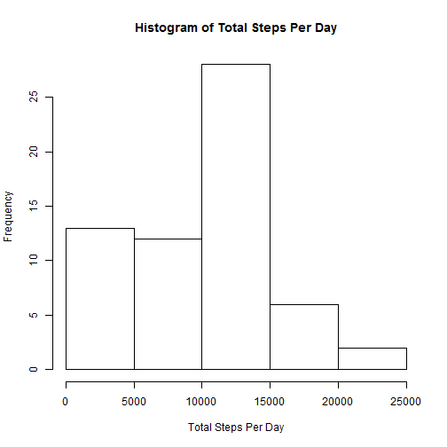
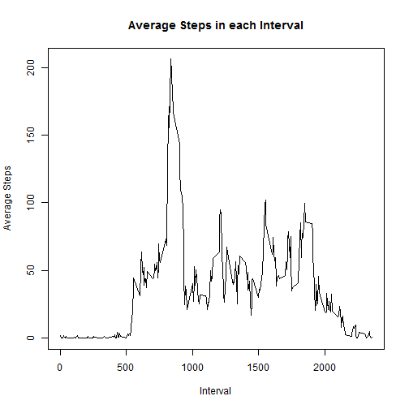
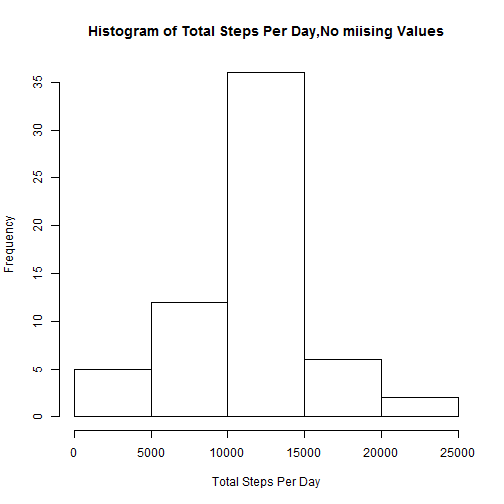
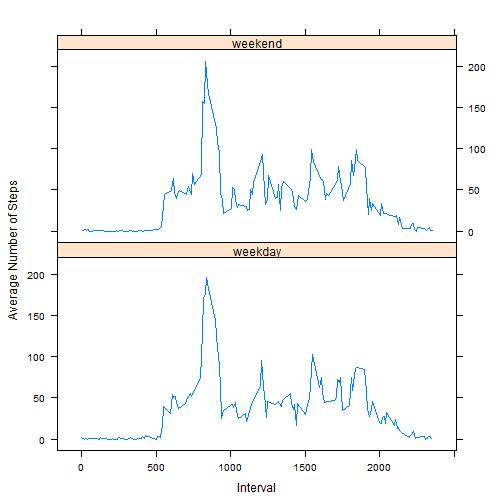

### Loading and preprocessing the data

```r
unzip("activity.zip")
rowdata<-read.csv("activity.csv")
```


### Mean total number of steps taken per day
Total number of steps taken per day:

```r
tot_steps_d<-sapply(split(rowdata$steps,rowdata$date),sum,na.rm=TRUE)
tot_steps_d
```

```
## 2012-10-01 2012-10-02 2012-10-03 2012-10-04 2012-10-05 2012-10-06 
##          0        126      11352      12116      13294      15420 
## 2012-10-07 2012-10-08 2012-10-09 2012-10-10 2012-10-11 2012-10-12 
##      11015          0      12811       9900      10304      17382 
## 2012-10-13 2012-10-14 2012-10-15 2012-10-16 2012-10-17 2012-10-18 
##      12426      15098      10139      15084      13452      10056 
## 2012-10-19 2012-10-20 2012-10-21 2012-10-22 2012-10-23 2012-10-24 
##      11829      10395       8821      13460       8918       8355 
## 2012-10-25 2012-10-26 2012-10-27 2012-10-28 2012-10-29 2012-10-30 
##       2492       6778      10119      11458       5018       9819 
## 2012-10-31 2012-11-01 2012-11-02 2012-11-03 2012-11-04 2012-11-05 
##      15414          0      10600      10571          0      10439 
## 2012-11-06 2012-11-07 2012-11-08 2012-11-09 2012-11-10 2012-11-11 
##       8334      12883       3219          0          0      12608 
## 2012-11-12 2012-11-13 2012-11-14 2012-11-15 2012-11-16 2012-11-17 
##      10765       7336          0         41       5441      14339 
## 2012-11-18 2012-11-19 2012-11-20 2012-11-21 2012-11-22 2012-11-23 
##      15110       8841       4472      12787      20427      21194 
## 2012-11-24 2012-11-25 2012-11-26 2012-11-27 2012-11-28 2012-11-29 
##      14478      11834      11162      13646      10183       7047 
## 2012-11-30 
##          0
```
Histogram of the total number of steps taken each day:

```r
hist(tot_steps_d,xlab="Total Steps Per Day",main = "Histogram of Total Steps Per Day" )
```

 

Mean and Meadian are: 

```r
mean(tot_steps_d)
```

```
## [1] 9354.23
```

```r
median(tot_steps_d)
```

```
## [1] 10395
```


###Average daily activity pattern
Time series plot of the 5-minute interval and the average number of steps taken:

```r
avg_steps_int<-sapply(split(rowdata$steps,rowdata$interval),mean,na.rm=TRUE)
plot(names(avg_steps_int),avg_steps_int,type="l",ylab="Average Steps", xlab="Interval",main="Average Steps in each Interval")
```

 

The 5-minute interval that contains the maximum number of steps,on average is: 

```r
names(which(avg_steps_int==max(avg_steps_int)))
```

```
## [1] "835"
```


### Imputing missing values
Total number of missing values in the dataset:

```r
sum(is.na(rowdata))
```

```
## [1] 2304
```
I will use the mean for the 5-minute interval.
New dataset with no missing values:

```r
goodata<-rowdata
goodata$steps[is.na(goodata[,1])]<-avg_steps_int[match(goodata[is.na(goodata[,1]),3],names(avg_steps_int))]
```
Histogram,Mean and Median of the total number of steps taken each day:

```r
tot_steps_d_good<-sapply(split(goodata$steps,goodata$date),sum)
hist(tot_steps_d_good,xlab="Total Steps Per Day",main = "Histogram of Total Steps Per Day,No miising Values" )
```

 

```r
mean(tot_steps_d_good)
```

```
## [1] 10766.19
```

```r
median(tot_steps_d_good)
```

```
## [1] 10766.19
```
yes, these resaults are diffrent. the median and mean are the same - the histogram is more centralized .


### differences in activity patterns between weekdays and weekends
New factor variable in the dataset with two levels “weekday” and “weekend”:

```r
days<-weekdays(as.Date(goodata$date))
goodata$days[days %in% unique(days)[1:4]]<-"weekday"
goodata$days[days %in% unique(days)[5:7]]<-"weekend"
goodata$days<-factor(c("weekday","weekend"))
```
Panel plot containing a time series plot of the 5-minute interval and the average number of steps taken,on weekdays and weekends:

```r
library(lattice)
wkd<-goodata[goodata$day=="weekday",]
wnd<-goodata[goodata$day=="weekend",]
wkdsteps<-sapply(split(wkd$steps,wkd$interval),mean)
wndsteps<-sapply(split(wnd$steps,wnd$interval),mean)
df1<-data.frame(interval=names(wkdsteps),mean=wkdsteps)
df1$day<-"weekday"
df1$interval<-as.numeric(as.character(df1$interval))
df2<-data.frame(interval=names(wndsteps),mean=wndsteps)
df2$day<-"weekend"
df2$interval<-as.numeric(as.character(df2$interval))
finaldata<-rbind(df1,df2)
xyplot(mean ~ interval|day,data=finaldata,layout=c(1,2),type = "l", xlab= "Interval",ylab="Average Number of Steps")
```

 
